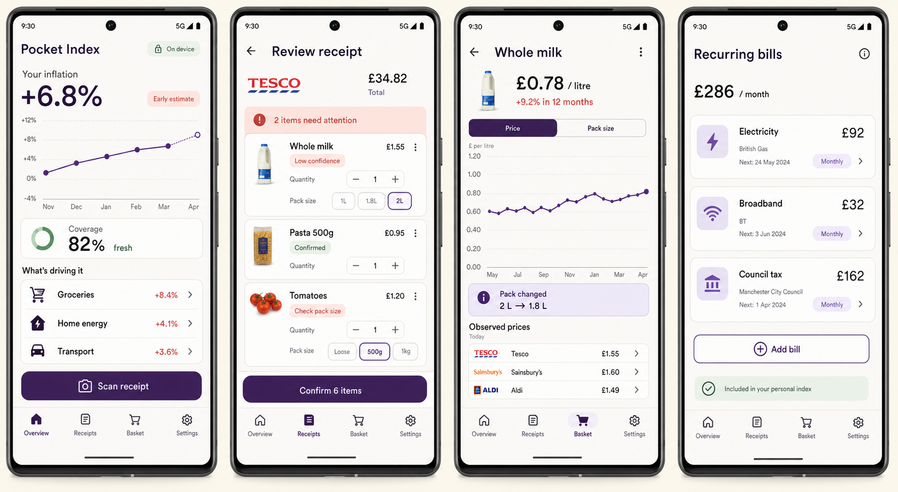

# Pocket Index

Pocket Index is a private, local-first Android app that calculates personal
inflation from receipt and recurring-bill history.

The app is designed around a simple loop:

1. Scan or import a receipt.
2. Review the locally extracted line items.
3. Confirm canonical products, quantities, and pack sizes.
4. Track comparable unit prices and personal inflation over time.

All data, receipt images, OCR, and calculations stay on the device. The app
does not request network access, create accounts, or include analytics.



## Implemented

- Material 3 Compose shell based on the first Pixel 7 Pro design direction
- Overview, receipt review, product history, and recurring-bills screens
- Add and edit recurring bills, including cadence; soft removal keeps price history
- Google ML Kit document scanning and bundled on-device OCR
- Deterministic UK receipt parsing, pack-size extraction, fuzzy matching, and
  receipt-total validation
- Room schema and transactional repositories for receipts, products,
  observations, aliases, and recurring bills
- Fixed-basket Laspeyres calculations, per-merchant carry-forward, staleness,
  coverage, category weights, chain linking, and headline-rate estimates
- Vico charts, Hilt dependency injection, coroutines, and Flow
- Debug-only sample data for manual QA

See [personal_inflation_tracker.md](personal_inflation_tracker.md) for the
complete product and calculation specification.

## Build and test

The project targets API 36, supports API 23+, and uses JDK 17 bytecode.

```powershell
$env:JAVA_HOME = "C:\Program Files\Android\Android Studio\jbr"
$env:ANDROID_HOME = "$env:LOCALAPPDATA\Android\Sdk"
.\gradlew.bat testDebugUnitTest assembleDebug
```

The debug APK is written to
`app/build/outputs/apk/debug/app-debug.apk`.

## Project structure

- `app/src/main/.../data` — Room entities, DAOs, and repositories
- `app/src/main/.../extraction` — OCR adapter and deterministic receipt parser
- `app/src/main/.../domain` — pure personal-inflation calculations
- `app/src/main/.../ui` — Compose screens, navigation, and view models
- `app/src/test` — parser and inflation-domain tests
- `design` — Pixel 7 Pro design references
